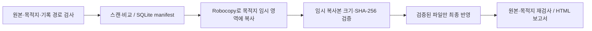

# SafeFileSync for Windows

[](https://github.com/sebia1993/safe-file-sync-windows/actions/workflows/windows.yml)
[](LICENSE)

Windows 11에서 **원본을 읽기 전용으로 유지**하며 로컬 또는 SMB/UNC 폴더로 복사하고 결과를 검증하는 한국어 데스크톱 도구입니다. C# · .NET 10 · WPF · Robocopy · SQLite를 사용합니다.

현재 버전은 **0.1.0-alpha.6 사전 릴리스**입니다. [Windows x64 배포 ZIP·SHA256SUMS·빌드 정보](https://github.com/sebia1993/safe-file-sync-windows/releases/tag/v0.1.0-alpha.6)에서 받을 수 있습니다. 자동 검증과 현장 검증 범위는 [검증 기록](docs/VALIDATION.md)을 확인하세요.

## 포트폴리오 요약

| 관점 | 내용 |
|---|---|
| 해결한 문제 | 중요한 폴더를 복사할 때 원본 보존, 기존 목적지 충돌, 내용 일치와 중단 후 재개 결과를 각각 확인해야 하는 문제 |
| 구현 범위 | 한국어 WPF UI, 경로·원본 보호, Robocopy 전송, SHA-256 검증, SQLite 작업 이력·재개, HTML 보고서와 Windows 패키징 |
| 핵심 설계 판단 | 원본 쓰기를 차단하고 임시 복사본 검증 후 파일별로 반영하며, 전송 처리율·원본 검사·복제율·SHA-256 검증률을 구분 |
| 검증 근거 | 경로·링크·잠금·손상·취소/재개 회귀 테스트, Windows 로컬/loopback SMB, 단일 EXE WPF 및 ZIP smoke 검증 |
| 증거의 한계 | 합성 입력과 GitHub Windows 러너 기준이며 실제 회사 SMB·Windows 11 PC·EDR/DLP·물리 단절 검증과 구분 |

### 검토 시 읽는 순서

1. 아래 사용 순서와 설계 판단에서 **무엇을 보존하고 어떤 조건에서 복사를 완료로 보는지** 확인합니다.
2. [설계 사례와 코드·회귀 테스트 연결](docs/PORTFOLIO_KO.md)에서 기존 파일 충돌, 내용 손상, 중단 중 원본 변경을 다루는 구현을 확인합니다.
3. 같은 문서의 [합성 입력 재현](docs/PORTFOLIO_KO.md#장비-없이-재현하기)과 [검증 근거·한계](docs/PORTFOLIO_KO.md#검증-근거와-한계)를 대조합니다. 실제 업무 시간 절감이나 데이터 손실 방지 실적 수치는 주장하지 않습니다.

## 사용 순서

1. 배포 ZIP에서 `SafeFileSync.App.exe`를 꺼내 실행합니다. .NET 별도 설치나 관리자 실행은 필요하지 않으며 EXE만 옮겨도 동작합니다.
2. 원본 목록에 폴더를 추가하고 **이미 존재하는 목적지 폴더**를 선택합니다. 각 원본의 목적지 폴더 이름과 실제 배치를 확인하세요. UNC 경로나 연결된 네트워크 드라이브를 사용할 수 있으며 현재 Windows 로그인 계정의 SMB 권한을 사용합니다.
3. `폴더 비교`로 누락·불일치·목적지 추가·검사 불가 항목을 확인합니다. 비교만으로 목적지에 파일을 복사하지 않습니다.
4. 기본 정책은 기존 목적지 파일 보존입니다. 불일치 파일을 바꾸려면 `불일치 기존 파일을 검증 후 교체`를 선택합니다.
5. `복사 시작`을 누릅니다. 작업별 임시 폴더에서 크기와 SHA-256을 확인한 파일만 최종 위치에 반영합니다.
6. 전송 처리율, 원본 검사, 복제율, SHA-256 검증률을 각각 확인하고 `결과 보고서`를 엽니다.
7. 중지/실패 후에는 이력에서 작업을 선택하여 재개하거나 실패 항목만 재시도합니다. 재개할 때 양쪽 폴더를 다시 검사하므로 오래된 완료 상태를 신뢰하지 않습니다. 작업 정책과 최초 원본 manifest는 재개 시 유지됩니다. 중지 중 원본이 바뀌면 재개 후에도 변경 경고를 남깁니다. 변경된 원본을 새 기준으로 사용할 때는 새 복사 작업을 시작하세요.

작업 기록은 프로그램이 자동으로 관리합니다. 별도의 기록 경로 입력이나 선택 없이 비교·복사하고, 앱을 다시 열어도 작업 이력에서 재개할 수 있습니다. 시스템 드라이브 전체 대신 전송할 폴더를 선택하세요.

## 해결하려 한 문제와 설계 판단

| 상황 | 설계 판단 | 확인할 근거 |
|---|---|---|
| 기록·목적지 경로가 원본과 겹침 | 실제 경로와 모든 원본의 겹침을 확인하고 기록·복사 전에 차단 | [원본 보호와 경로 경계](docs/PORTFOLIO_KO.md#원본-보호와-경로-경계) |
| 같은 이름의 목적지 파일이 이미 존재 | 기본은 보존, 교체 선택 시에도 임시 복사본 크기·SHA-256 확인 후 파일별 반영 | [기존 파일과 내용 검증](docs/PORTFOLIO_KO.md#기존-파일과-내용-검증) |
| 파일 크기·수정시간은 같지만 내용이 다름 | 빠른 비교와 SHA-256 검증을 구분하고 빠른 일치를 내용 검증으로 표시하지 않음 | [비교·전송 회귀 테스트](tests/SafeFileSync.Tests/TransferTests.cs) |
| 중지 중 원본이 바뀌거나 작업이 중단됨 | 최초 manifest와 작업 정책을 유지하고 재스캔하여 원본 변경 경고를 보존 | [중단과 재개](docs/PORTFOLIO_KO.md#중단과-재개) |
| 여러 원본에 같은 상대 파일명이 있음 | 원본별 목적지 하위 폴더와 저장된 매핑을 사용 | [다중 원본 회귀 테스트](tests/SafeFileSync.Tests/MultiSourceTests.cs) |
| 지원 요청에 내부 경로·로그가 섞일 수 있음 | 코드 복사는 정해진 오류 종류만 출력, 상세 보고서와 분리 | [오류코드 경계 테스트](tests/SafeFileSync.Tests/DiagnosticCodeTests.cs) |

## 동작 구조



`폴더 비교`는 스캔·비교까지 수행하며 목적지 하위 폴더나 복사본을 만들지 않습니다. 복사는 파일별로 반영하므로 폴더 전체의 원자적 트랜잭션이나 단일 시점의 볼륨 스냅샷을 보장하지 않습니다. 구성요소별 책임은 [프로그램 구조](docs/ARCHITECTURE.md)에 정리되어 있습니다.

## 짧은 오류코드

문제가 생기면 화면의 **코드만 복사**를 눌러 `S03`처럼 3자리 코드만 전달할 수 있습니다. 코드에는 미리 정한 오류 종류만 들어가며 경로·파일명·서버 주소·사용자명·작업 ID·시각·해시·로그를 포함하거나 인코딩하지 않습니다. 앱이 외부로 진단을 자동 전송하지 않습니다.

예를 들어 `S03`은 기록 위치가 원본/목적지와 겹친 경우, `S07`은 파일 사용 중, `S13`은 기존 목적지 항목과의 충돌입니다. 자세한 뜻과 확인 방법은 [오류코드 안내](docs/ERROR_CODES.md)를 확인하세요. 여러 문제가 있으면 우선 확인할 대표 코드 하나를 표시합니다. 이 코드만으로 내부 상세 로그를 복원하거나 개별 파일을 식별할 수는 없습니다. 기존 보고서·로그·화면의 상세 내용은 내부 경로를 포함할 수 있으므로 코드 복사와 구분합니다.

## 여러 원본 폴더

새 작업은 원본마다 별도 하위 폴더를 만듭니다. 원본 `A`, `B`와 목적지 `Z:\`를 선택하면 `Z:\A`, `Z:\B`에 복사합니다. 원본이 하나인 새 작업에도 같은 배치 규칙을 적용합니다. 폴더 이름이 같은 원본들은 목록에서 목적지 폴더 이름을 서로 다르게 지정하세요. 원본 목록에 같은 폴더나 서로 포함된 폴더를 중복 추가할 수 없습니다.

모든 원본을 검사한 뒤 복사를 시작하며, 기록 위치와 목적지는 **모든 원본**에서 분리돼야 합니다. 비교만 하면 목적지 하위 폴더를 만들지 않습니다. 결과 목록은 `A\파일`, `B\파일`처럼 구분하고 보고서에는 전체 원본→목적지 매핑을 표시합니다.

원본 목록과 목적지 폴더 이름은 작업 이력에 함께 저장합니다. 재개/실패 재시도에는 저장된 매핑을 사용하고, 다른 구성을 원하면 새 작업을 시작하세요. 이전 버전의 단일 원본 이력은 기존의 ‘목적지 바로 아래’ 배치 그대로 재개합니다.

## 검증 방식

| 방식 | 확인하는 내용 | 한계 |
|---|---|---|
| 빠른 검증 | 상대 경로, 파일/폴더 구분, 파일 크기와 수정시간 | 같은 크기·시간의 내용 변경은 찾지 못합니다. 전체 SHA-256 검증으로 표시하지 않습니다. |
| SHA-256 | 파일 기본 데이터 스트림의 SHA-256 및 폴더 존재 | 원본과 목적지를 추가로 읽으므로 시간이 더 걸립니다. ACL/ADS 완전 복제가 아닙니다. |

실제로 새로 전송하는 파일은 선택 모드와 관계없이 임시 복사본 SHA-256을 검사합니다. 목적지 추가 파일은 보존하며 별도로 표시합니다. 빈 폴더도 비교합니다. 오류나 제외된 링크가 있으면 완전 검증으로 계산하지 않습니다.

## 원본 보호

- 원본 삭제·이동·이름 변경·쓰기·truncate·파일 생성 기능이 없습니다.
- `/MOV`, `/MOVE`, `/MIR`, `/PURGE`와 사용자 지정 Robocopy 옵션을 허용하지 않습니다.
- 동일/중첩 경로, reparse point, 목적지 하드링크, 확인된 물리 경로 별칭을 차단합니다.
- 전송 중 해당 원본 파일을 읽기 핸들로 잠그고 전후 manifest를 비교합니다.
- 기존 목적지 파일은 검증된 복사본을 원자적으로 반영할 때까지 보존합니다. 목적지 추가 파일을 정리하는 기능은 없습니다.
- 자격 증명을 저장하거나 회사 보안 정책을 우회하지 않습니다.

[안전 모델](docs/SAFETY_MODEL.md)에 보장 범위와 한계를 설명했습니다.

## 기록과 임시 파일

작업 DB·Unicode Robocopy 로그·HTML 보고서는 프로그램의 내부 기본 위치에 저장합니다. 화면에는 기록 경로 설정이나 미리보기를 표시하지 않습니다. 앱 시작이나 이력 조회만으로 폴더를 만들지 않으며, 작업 시작 후 모든 원본·목적지와 겹치지 않는지 검사한 다음 생성합니다.

기본 위치에 새로 만드는 기록 폴더는 현재 사용자·SYSTEM·Administrators만 허용하도록 권한을 지정합니다. 기존 기본 기록 폴더는 소유자와 허용 권한을 검사하고 ACL을 자동 변경하지 않습니다. 생성 권한이 없거나 기존 권한이 안전하지 않으면 `S04`를 표시합니다. 내부 위치가 선택한 원본·목적지와 겹치면 `S03`으로 중단하며, 원본 안에 기록하거나 다른 위치로 임의 전환하지 않습니다. 오류 화면에는 내부 예외의 경로 대신 짧은 코드와 고정된 안내를 표시합니다.

alpha.5 기본 위치의 이력은 계속 자동으로 불러옵니다. 과거 AppData 또는 사용자 지정 위치의 기록은 이동하거나 삭제하지 않지만, 이번 화면에서는 해당 위치의 이력을 선택하지 않습니다. 이력은 최근 100개 작업, 화면은 차이 항목을 우선한 최대 1,000개 항목을 표시합니다. 전체 결과는 HTML 보고서에 포함됩니다.

목적지의 `.safefilesync-<작업 ID>`는 재개용 임시 영역입니다. 취소된 복사본과 빈 작업 폴더를 보존하며 자동으로 재귀 삭제하지 않습니다. 더 이상 재개하지 않을 작업의 임시 폴더는 작업 종료 후 사용자가 확인하여 정리할 수 있습니다. 현재 작업의 임시 영역만 해당 작업의 비교 결과에서 제외합니다.

## 알려진 범위

- 같은 Windows 세션에서는 앱을 하나만 실행하여 겹치는 작업을 방지합니다.
- Windows x64용 설치 없는 단일 EXE 배포이며 현재 실행 파일은 Authenticode 서명이 없습니다.
- GitHub Windows 러너의 로컬/loopback SMB와 GUI 자동 검증은 실제 사내 네트워크·EDR/DLP·물리 단절·Windows 11 현장 검증을 대신하지 않습니다.
- SMB 시스템 호출이 응답하지 않으면 중지 요청 반영에 시간이 걸릴 수 있습니다.
- 원본 링크는 복사에서 제외하고 확인 필요로 표시합니다. 열린 쓰기 파일이나 스캔 오류로 원본 영역을 확실히 검사하지 못하면 복사를 차단합니다.
- 단일 시점의 볼륨 스냅샷이나 NTFS 전체 복제 도구가 아닙니다. 악의적인 관리자/SMB 서버에 대한 OS 보안 경계도 아닙니다.
- 필요한 전송량에 여유 공간을 더한 보수적인 사전 공간 검사를 수행합니다. 재개 시 임시 파일이 차지하는 공간도 고려하여 여유 공간을 확보하세요.

단일 EXE에 포함된 네이티브 런타임은 앱 시작 전 `%TEMP%\.net`에 추출되므로 임시 폴더 쓰기 권한이 필요합니다. 이는 [.NET 단일 파일 배포 방식](https://learn.microsoft.com/en-us/dotnet/core/deploying/single-file/overview)에 따른 동작입니다.

## 개발

```powershell
dotnet test SafeFileSync.slnx -c Release --filter "Category!=Smb"
dotnet run --project src/SafeFileSync.App
dotnet publish src/SafeFileSync.App -c Release -r win-x64 --self-contained true -o artifacts/app
```

SMB 테스트는 워크플로가 만드는 격리된 공유를 사용합니다. macOS 크로스 빌드는 Windows 실행 검증이 아니며 Windows CI 결과를 별도로 확인합니다.

[개발 계획](CODEX_DEVELOPMENT_PLAN.md) · [현장 점검](docs/ACCEPTANCE.md) · [Microsoft Robocopy 문서](https://learn.microsoft.com/en-us/windows-server/administration/windows-commands/robocopy)

## 문서

| 문서 | 용도 |
|---|---|
| [설계 사례·코드·테스트](docs/PORTFOLIO_KO.md) | 대표 실패 상황과 구현 근거, 합성 재현 방법 |
| [프로그램 구조](docs/ARCHITECTURE.md) | UI·Core·Windows 전송 계층의 책임과 데이터 흐름 |
| [안전 모델](docs/SAFETY_MODEL.md) | 원본·경로·임시 복사·최종 반영의 보장 범위 |
| [검증 계획](docs/TEST_PLAN.md) / [검증 기록](docs/VALIDATION.md) | 자동 검증 항목과 기록된 실행 근거 |
| [현장 점검](docs/ACCEPTANCE.md) | 실제 Windows 11·회사 SMB·보안 정책의 별도 확인 |
| [오류코드 안내](docs/ERROR_CODES.md) | 짧은 코드의 의미와 다음 확인 |
| [기여 안내](CONTRIBUTING.md) / [보안 제보](SECURITY.md) | 변경·회귀 검증 원칙과 민감정보 취급 |

## 라이선스

프로젝트 코드는 [MIT License](LICENSE)로 공개합니다.
